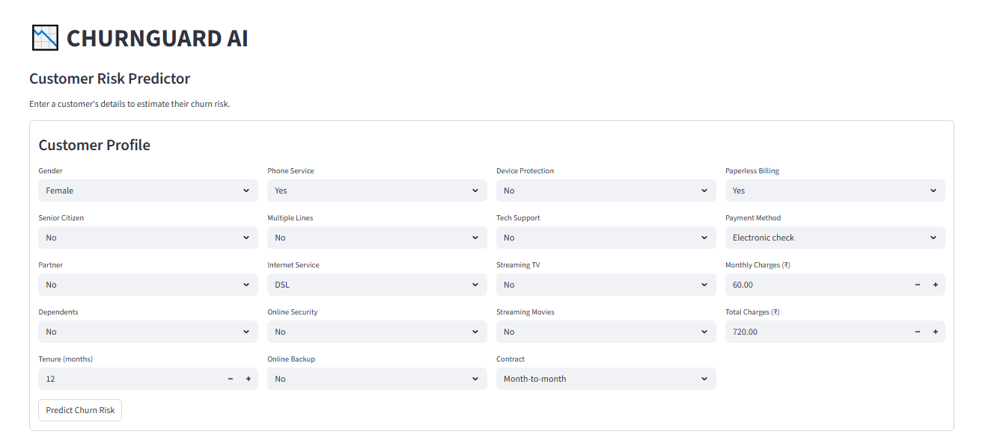
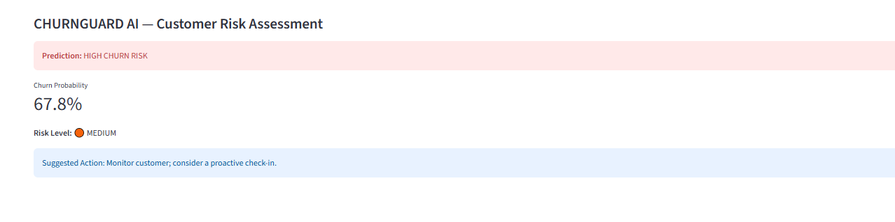
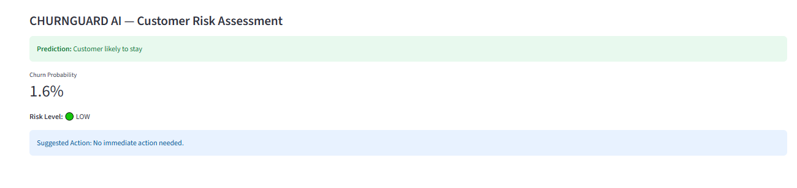

# CHURNGUARD AI

**Customer Churn Prediction & Retention Intelligence System**
MainCrafts Technology — 2-Day Skill Certification Program (Artificial Intelligence & Machine Learning)

---

## 📌 Project Brief

Businesses often discover that a customer is leaving only after the customer has already decided to go. CHURNGUARD AI is an end-to-end machine learning system that analyzes historical customer data, learns the patterns behind churn, and predicts whether a customer is likely to leave — **before** it happens.

The workflow follows a complete ML pipeline:

```
Raw Data → Data Understanding → Cleaning → Feature Preparation → Model Training → Evaluation → Prediction → Business Insight
```

---

## 🎯 What It Does

- Analyzes customer account and service data
- Identifies patterns linked to churn
- Prepares data for machine learning (encoding, scaling)
- Trains and compares multiple classification models
- Evaluates the selected model on unseen data
- Predicts churn risk for new customers
- Identifies the features that influence predictions most
- Produces practical, business-facing recommendations
- Includes an optional Streamlit web app for interactive predictions

---

## 🗂️ Dataset

- **Source:** IBM Telco Customer Churn dataset
- **File:** `WA_Fn-UseC_-Telco-Customer-Churn.csv`
- **Records used:** 7,010 (after cleaning)
- **Target column:** `Churn` (Yes / No)
- **Problem type:** Binary classification

---

## 🛠️ Tools & Libraries

| Category | Tools |
|---|---|
| Environment | Google Colab |
| Language | Python |
| Data handling | Pandas, NumPy |
| Visualization | Matplotlib, Seaborn |
| Machine Learning | Scikit-learn |
| Model persistence | Joblib |
| Web interface (optional) | Streamlit |

---

## 🔍 Methodology

1. **Data Understanding** — inspected shape, dtypes, missing values, duplicates, and identified the target column
2. **Data Cleaning** — converted `TotalCharges` to numeric and removed rows with missing values
3. **Exploratory Data Analysis** — 4 visualizations covering churn distribution, churn vs. contract type, churn vs. tenure, and churn vs. monthly charges
4. **Feature Preparation** — separated numerical and categorical features, encoded categoricals with `OneHotEncoder`, scaled numerics with `StandardScaler`, all wrapped in a `ColumnTransformer`
5. **Model Training** — trained two baseline classifiers inside `Pipeline` objects: Logistic Regression and Random Forest
6. **Model Evaluation** — compared Accuracy, Precision, Recall, and F1-score on a held-out test set (80/20 split, stratified)
7. **Model Improvement** — addressed class imbalance using `class_weight="balanced"` on Logistic Regression
8. **Risk Categorization** — converted churn probability into HIGH / MEDIUM / LOW risk bands
9. **Feature Importance** — extracted and visualized the most influential features from the final model's coefficients
10. **Prediction Function** — built a reusable function to score a single new customer
11. **Business Interpretation** — translated model output into recommendations and stated limitations

---

## 📊 Results

| Model | Accuracy | Precision | Recall | F1 Score |
|---|---|---|---|---|
| Logistic Regression (baseline) | 0.8081 | 0.6700 | 0.5418 | 0.5991 |
| Random Forest | 0.7896 | 0.6367 | 0.4771 | 0.5455 |
| **Logistic Regression (Improved, `class_weight="balanced"`)** | **0.7439** | **0.5106** | **0.7763** | **0.6160** |

**Selected model:** Logistic Regression (Improved)

The improved model trades some accuracy for a much higher **recall** — deliberately, since in this business problem a **false negative** (a customer who churns but was predicted to stay) is more costly than a false positive. Missing a real churn case means losing a customer with no retention attempt made; a false alarm only costs an unnecessary check-in.

### Most Important Findings
1. Month-to-month contract customers show higher churn than customers on longer-term contracts.
2. Customers with lower tenure show higher churn.
3. Higher monthly charges are associated with higher churn.

### Business Recommendation
Target higher-risk customers with proactive retention efforts — particularly those on month-to-month contracts, with low tenure and high monthly charges.

### Limitations
Model predictions are probabilistic, not certainties. Performance depends on the quality and recency of the training data, and the model should be re-validated periodically as customer behavior changes.

---

## 🖥️ Streamlit Web App (Optional Advanced Challenge)

A simple interactive interface — **CHURNGUARD AI: Customer Risk Predictor** — lets you enter a customer's details and get an instant churn risk assessment.

**Inputs:** demographics (gender, senior citizen, partner, dependents), account details (tenure, contract, billing, payment method), services (phone, internet, security, backup, support, streaming), and charges (monthly, total).

**Output:** churn prediction, churn probability, risk level (🔴 HIGH / 🟠 MEDIUM / 🟢 LOW), and a suggested retention action.

### Run it locally

```bash
pip install -r requirements.txt
streamlit run app.py
```

Make sure `churn_guard_final_model.pkl` is in the same folder as `app.py` before running.

### Example Results

| Interface | High Risk Prediction | Low Risk Prediction |
|---|---|---|
|  |  |  |

---

## 📁 Project Structure

```
CHURNGUARD-AI/
├── README.md
├── churn_prediction.ipynb
├── app.py
├── requirements.txt
├── churn_guard_final_model.pkl
├── dataset/
│   └── WA_Fn-UseC_-Telco-Customer-Churn.csv
├── images/
│   ├── interface.png
│   ├── High_risk.png
│   └── Low_risk.png
└── report/
    └── project_report.pdf
```

---

## 🚀 Future Improvements

- Hyperparameter tuning (GridSearchCV / RandomizedSearchCV) for further F1 gains
- Try additional models (XGBoost, Gradient Boosting) for comparison
- Handle class imbalance with SMOTE as an alternative to `class_weight`
- Add SHAP values for more interpretable feature explanations
- Deploy the Streamlit app to Streamlit Community Cloud for public access

---

## 👤 Candidate

**Gowtham K R**
BCA (Computer Science), The National Degree College, Bagepalli
MainCrafts Technology — Skill Sprint Challenge
